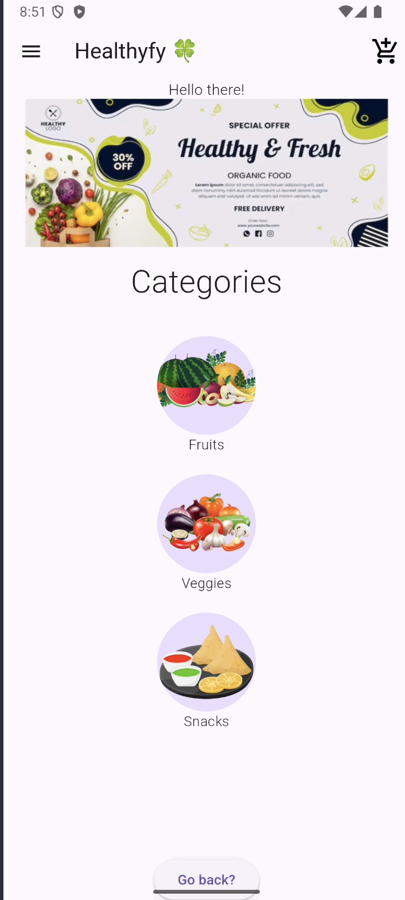
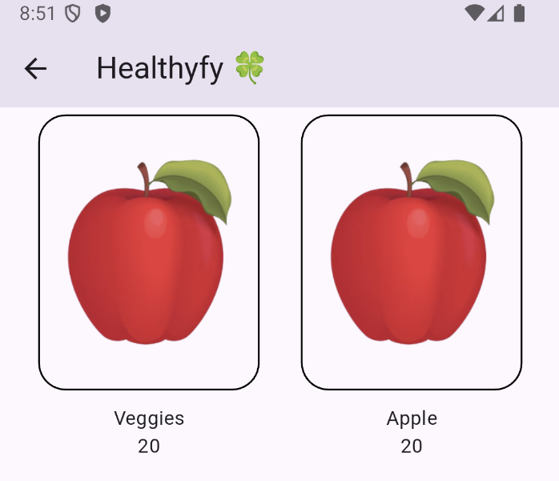
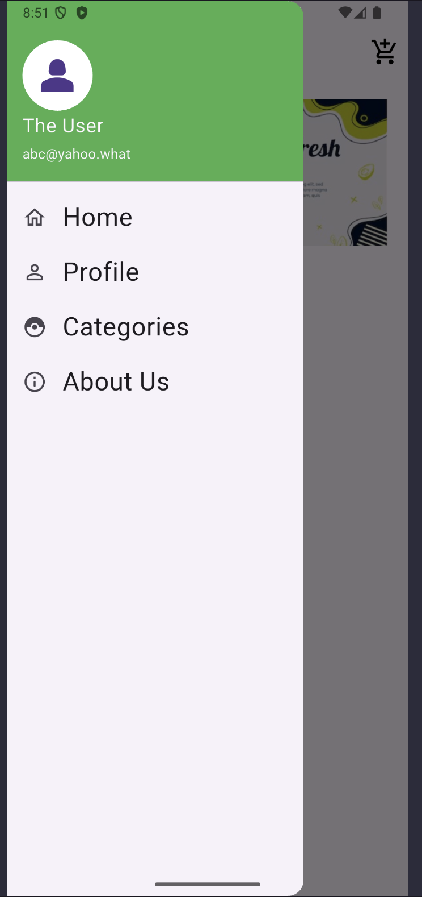
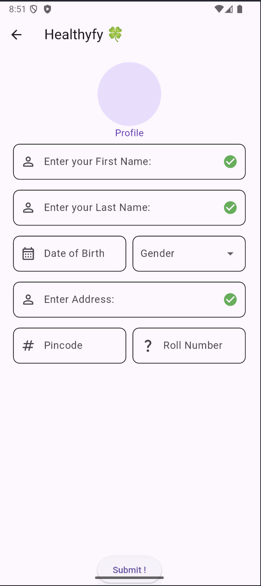

#  Healthyfy🍀 – Grocery Shopping App (Flutter)

HealthyFy is a clean and user-friendly **grocery shopping mobile application** built with **Flutter**.  
It allows users to browse fresh groceries, add items to cart, manage quantities, and place orders seamlessly.  
Designed with simplicity, performance, and a modern UI in mind.

---

##  Features

-  **Browse Groceries** — Fruits, vegetables, dairy, and more  
-  **Add to Cart** — Simple and intuitive cart management  
-  **Search Functionality** — Quickly find items  
-  **Favorites** — Save frequently bought items  
-  **Responsive UI** across all screen sizes  

---


### Main Screens

|  |


|  |  |  |

---

##  Tech Stack

- **Flutter** (Dart)
- **State Management**: Provider / Riverpod / Bloc  
- **Backend**: Firebase / REST API / Local JSON  
- **Packages**: Google Fonts, Lottie, Cached Network Image

---

##  Getting Started

Clone the repository:

```bash
git clone https://github.com/your-username/healthyfy.git
cd healthyfy
